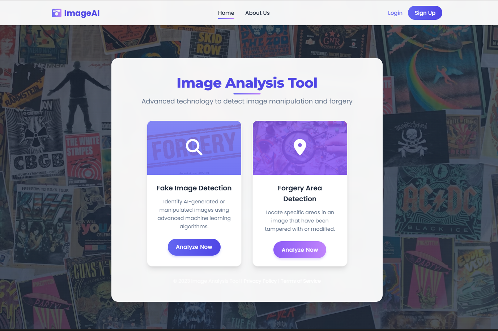

Here's a well-structured **README.md** file for your image forgery detection project:  

---

# 🖼️ Image Forgery Detection  

## 🔍 Overview  
This project aims to detect forged images using a deep learning-based **Discriminator model**. It classifies images as **authentic** or **forged** by analyzing features extracted from the image. The model is trained on real and manipulated images and deployed using **Flask** for easy interaction.  

## 🚀 Features  
✅ **Deep Learning Model** – Uses a convolutional neural network (CNN) to analyze image authenticity.  
✅ **Forgery Probability** – Provides a probability score indicating the likelihood of an image being forged.  
✅ **Batch Processing** – Supports analysis of multiple images in a directory.  
✅ **Flask API Integration** – Easily interact with the model via a simple web interface.  
✅ **Confidence-Based Prediction** – Classifies images as "Highly Likely Forged," "Likely Forged," "Likely Authentic," or "Highly Likely Authentic."  

## 📁 Project Structure  
```
├── model/
│   ├── discriminator.pth          # Pretrained model weights
│   ├── train.py                   # Model training script
├── app/
│   ├── app.py                      # Flask-based API
│   ├── static/
|                                     
├── datasets/
│   ├── real_images/                  # Folder containing real images
│   ├── forged_images/                # Folder containing forged images
├── requirements.txt                   # Required dependencies
├── README.md                          # Project documentation
```

## 🛠️ Installation  

### 🔹 Prerequisites  
Ensure you have **Python 3.8+** installed, along with the necessary dependencies.  

### 🔹 Install Dependencies  
```bash
pip install -r requirements.txt
```

### 🔹 Download Pretrained Model  
Place the **discriminator.pth** file in the `model/` directory.  

## 🖼️ Usage  

### 🔹 Single Image Detection  
```python
from utils.inference import detect_image_forgery

result = detect_image_forgery("model/discriminator.pth", "test_image.jpg")
print(result)
```

### 🔹 Batch Processing for a Directory  
```python
from utils.inference import analyze_directory

results, summary = analyze_directory("model/discriminator.pth", "test_images/")
print(summary)
```

### 🔹 Run Flask App for Web Interface  
```bash
python app/app.py
```
Then open **http://127.0.0.1:5000** in your browser to upload images and check for forgery.  

## 🏗️ Model Training (Optional)  
To train the model on a custom dataset:  
```bash
python model/train.py --dataset /path/to/dataset --epochs 10
```

## 📜 License  
This project is licensed under the **MIT License**.  

## 🤝 Contributing  
Contributions are welcome! If you'd like to improve the model or add new features, feel free to submit a pull request.  

---

This README provides a **clear overview**, **installation guide**, **usage instructions**, and **contribution details**. 


<div align="center">
  
  
  <p><em>Home screen</em></p>
</div>
